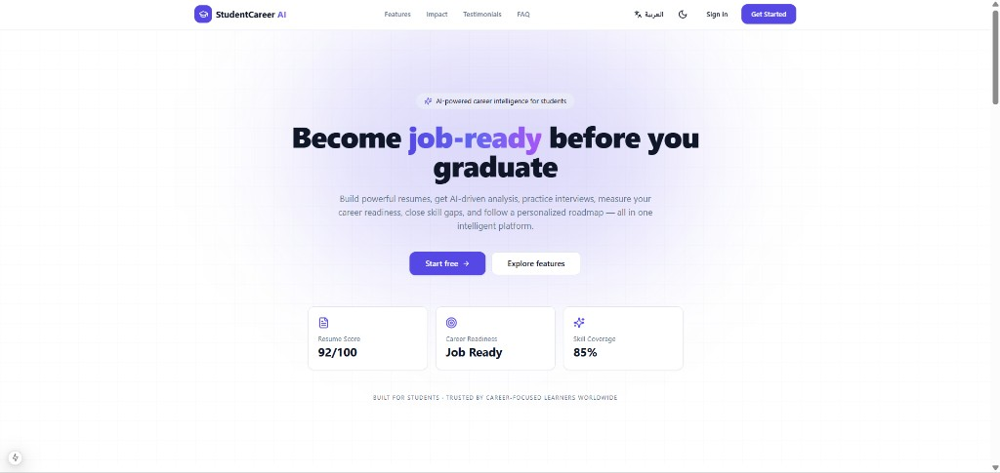
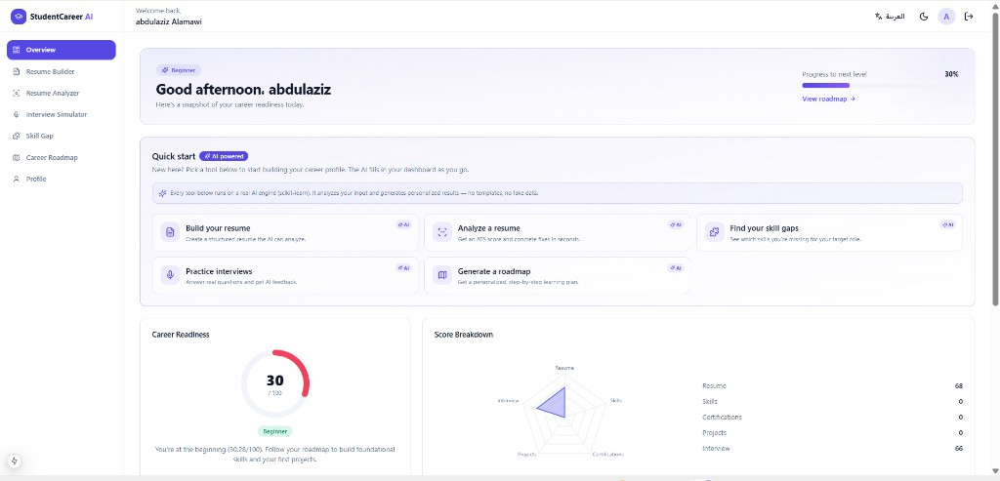
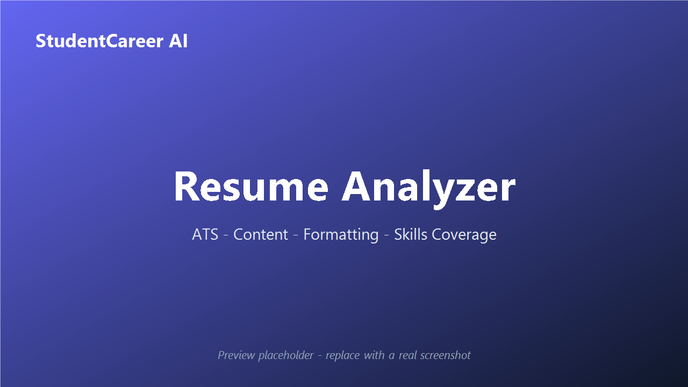
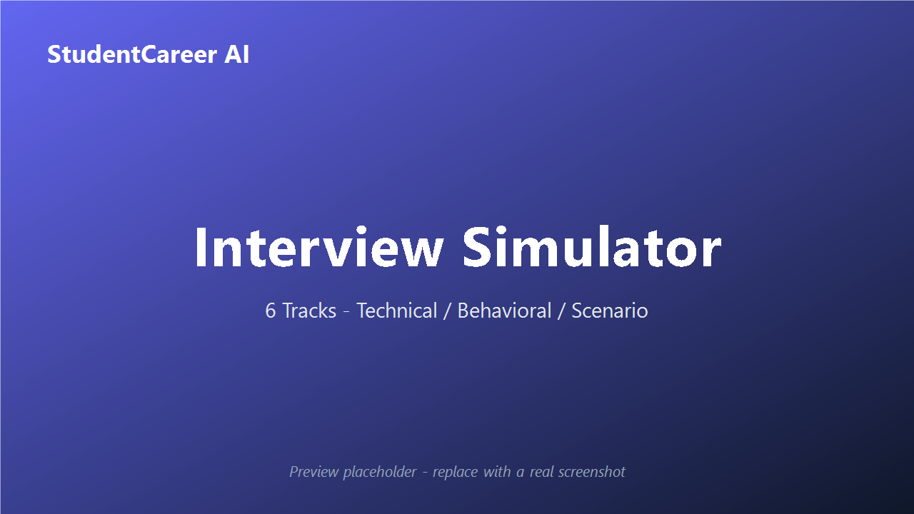
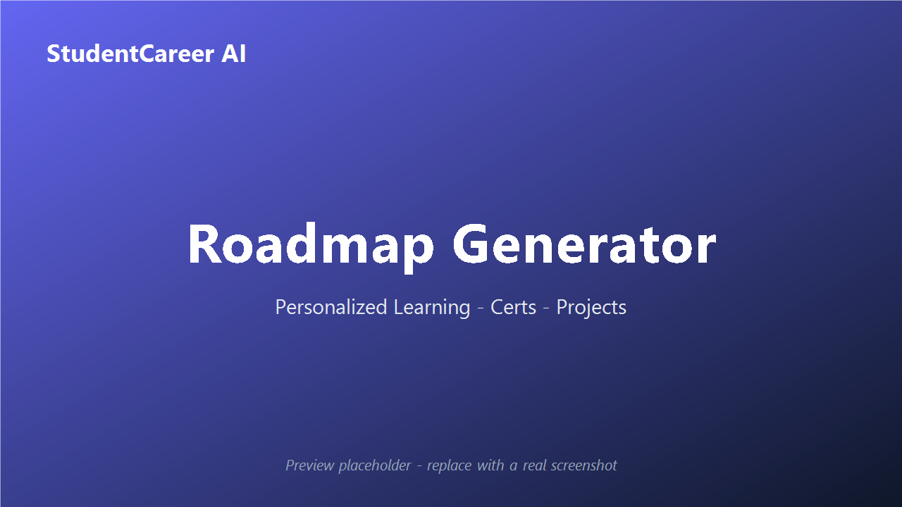

<div align="center">

#  StudentCareer AI Platform

### AI-Powered Career Intelligence & Readiness Platform

Helping students and graduates build stronger resumes, ace interviews, close skill gaps, and become **job-ready** through explainable AI recommendations and career analytics.

[](https://nextjs.org/)
[](https://fastapi.tiangolo.com/)
[](https://www.typescriptlang.org/)
[](https://www.python.org/)
[](https://www.postgresql.org/)
[](https://www.prisma.io/)
[](https://www.docker.com/)

[](./LICENSE)
[](./.github/workflows/ci.yml)
[](#-deployment-guide)

**Built and Maintained by Abdulaziz AlAmawi**

</div>

---

##  Table of Contents

- [Project Overview](#-project-overview)
- [Key Features](#-key-features)
- [System Architecture](#-system-architecture)
- [Technology Stack](#-technology-stack)
- [AI Modules](#-ai-modules)
- [Screenshots](#-screenshots)
- [Installation](#-installation)
- [API Documentation](#-api-documentation)
- [Deployment Guide](#-deployment-guide)
- [Folder Structure](#-folder-structure)
- [Project Statistics](#-project-statistics)
- [Testing](#-testing)
- [Future Improvements](#-future-improvements)
- [Author](#-author)
- [License](#-license)

---

##  Project Overview

**StudentCareer AI Platform** is a full-stack, AI-powered SaaS application designed to maximize the **employability** of university students and fresh graduates.

Instead of guessing whether they are ready for the job market, students get **data-driven, explainable insights**:

- An **AI Resume Analyzer** that scores ATS-compatibility and content quality.
- An **AI Interview Simulator** across six career tracks.
- A **Career Readiness Engine** that produces a single 0–100 readiness score.
- A **Skill Gap Analyzer** and **Career Roadmap Generator** powered by ML similarity models.

The platform is built with a clean, scalable, production-minded architecture and is fully deployable to **Vercel** (frontend) and **Railway** (backend + database). It also ships with full **bilingual support (English / Arabic)**.

---

##  Key Features

| Module | Description |
| --- | --- |
|  **Landing Page** | Modern SaaS marketing site: hero, features, stats, testimonials, FAQ, contact. |
|  **Authentication** | JWT-based register / login / logout, hashed passwords, protected routes, profiles. |
|  **Smart Resume Builder** | Create, edit, duplicate, and export resumes with 3 templates. |
|  **AI Resume Analyzer** | ATS score, completeness, formatting, content quality, missing-skills report. |
|  **AI Interview Simulator** | 6 career tracks; technical / behavioral / scenario questions; difficulty levels; scoring. |
|  **Career Readiness Engine** | Weighted readiness score (resume, skills, certs, projects, interview). |
|  **Skill Gap Analyzer** | Detects missing skills; recommends technologies, certifications, and projects. |
|  **Career Roadmap Generator** | Personalized learning / certification / project / career roadmaps. |
|  **User Dashboard** | Unified analytics dashboard for all modules with charts and score rings. |
|  **Bilingual UI** | Full English / Arabic localization with RTL support. |

---

##  System Architecture

```text
┌──────────────────────────────────────────────────────────────┐
│                        CLIENT (Browser)                        │
└───────────────────────────────┬──────────────────────────────┘
                                 │ HTTPS
              ┌──────────────────▼───────────────────┐
              │      Frontend — Next.js 15 (Vercel)   │
              │  App Router · Server/Client Components │
              │  Tailwind · Shadcn · Framer Motion     │
              └──────────────────┬───────────────────┘
                                 │ REST (JSON / JWT)
              ┌──────────────────▼───────────────────┐
              │       Backend — FastAPI (Railway)     │
              │  ┌──────────────┐  ┌────────────────┐ │
              │  │  API Routers │  │  Service Layer │ │
              │  └──────┬───────┘  └────────┬───────┘ │
              │         │      ┌────────────▼───────┐ │
              │         │      │     AI ENGINE      │ │
              │         │      │  scikit-learn /    │ │
              │         │      │  pandas / numpy    │ │
              │         │      └────────────────────┘ │
              │  ┌──────▼───────────────────────────┐ │
              │  │   Prisma ORM (Python client)      │ │
              │  └──────────────┬───────────────────┘ │
              └─────────────────┼─────────────────────┘
                                │ SQL
                   ┌────────────▼────────────┐
                   │  PostgreSQL 16 (Railway) │
                   └─────────────────────────┘
```

The system follows **Clean Architecture** principles with clear separation between
**API (routers) → Services (business logic) → AI Engine / Data (Prisma)**.
See [`docs/ARCHITECTURE.md`](./docs/ARCHITECTURE.md) for the full design.

---

##  Technology Stack

| Layer | Technologies |
| --- | --- |
| **Frontend** | Next.js 15 · React 18 · TypeScript · TailwindCSS · Framer Motion · Shadcn UI · Recharts |
| **Backend** | FastAPI · Python 3.11+ · Pydantic v2 · Uvicorn |
| **AI Layer** | Scikit-Learn · Pandas · NumPy (TF-IDF, cosine similarity, weighted scoring) |
| **Database** | PostgreSQL 16 · Prisma ORM (Python client) |
| **Auth** | JWT (python-jose) · Passlib / bcrypt |
| **DevOps** | Docker · Docker Compose · GitHub Actions · Vercel · Railway |

---

##  AI Modules

All AI logic lives in `backend/app/ai/` and is **deterministic, explainable, and dependency-free** (no external API calls by default). A pluggable provider interface allows an LLM/OpenAI backend to be added later.

| Module | File | What it does |
| --- | --- | --- |
| **Resume Analyzer** | `resume_analyzer.py` | Scores ATS, content quality, formatting, completeness, and skills coverage (0–100). |
| **Interview Evaluator** | `interview_evaluator.py` | Keyword-based scoring of interview answers with per-answer feedback. |
| **Readiness Engine** | `readiness_engine.py` | Weighted 0–100 career readiness score mapped to readiness levels. |
| **Skill Gap Analyzer** | `skill_gap.py` | Matches user skills against track profiles using TF-IDF + cosine similarity. |
| **Roadmap Generator** | `roadmap_generator.py` | Builds personalized, phased learning / certification / project roadmaps. |
| **Matching Engine** | `matching.py` | Core TF-IDF / cosine-similarity skill-matching utilities. |
| **Provider Interface** | `provider.py` | Pluggable AI provider (heuristic by default, OpenAI-ready). |

---

##  Screenshots

### Landing Page


### Dashboard


| Resume Analyzer | Interview Simulator | Roadmap Generator |
| :---: | :---: | :---: |
|  |  |  |

---

##  Installation

### Prerequisites
- Node.js ≥ 20
- Python ≥ 3.11
- PostgreSQL ≥ 14 (or Docker)

### 1. Clone
```bash
git clone https://github.com/Abdulaziz-Alamawi/StudentCareer-AI-Platform.git
cd StudentCareer-AI-Platform
```

### 2. Run everything with Docker (recommended)
```bash
docker compose up --build
```
- Frontend → http://localhost:3000
- Backend (Swagger) → http://localhost:8000/docs

### 3. Manual setup — Backend
```bash
cd backend
python -m venv .venv
# Windows: .venv\Scripts\activate   |   Unix: source .venv/bin/activate
pip install -r requirements.txt
cp .env.example .env          # set DATABASE_URL + SECRET_KEY
prisma generate
prisma db push
python -m app.seed            # optional: seed interview questions & skill catalog
uvicorn app.main:app --reload
```

### 4. Manual setup — Frontend
```bash
cd frontend
npm install
cp .env.example .env.local    # set NEXT_PUBLIC_API_URL
npm run dev
```

> **Windows tip:** run `.\scripts\start-dev.ps1` to launch backend + frontend in separate windows, and `.\scripts\start-db.ps1` for a local PostgreSQL instance.

### Troubleshooting

- **`prisma generate` → `spawn prisma-client-py ENOENT` (Windows):** ensure the virtual environment is **activated** so the venv `Scripts` directory is on `PATH`, then re-run `prisma generate`.
- **Non-ASCII project path (Windows):** the Prisma Python generator may fail when the absolute path contains non-ASCII characters. Clone the project to an ASCII path such as `C:\dev\StudentCareer-AI-Platform`. Docker, CI, Vercel, and Railway use ASCII paths and are unaffected.
- **Database schema:** this project uses Prisma's schema-first `prisma db push`; Docker and CI run it automatically.

---

##  API Documentation

Interactive docs (Swagger UI) are auto-generated at `http://localhost:8000/docs`.
A written reference lives in [`docs/API.md`](./docs/API.md).

Key endpoint groups (prefixed with `/api/v1`):

| Method | Endpoint | Description |
| --- | --- | --- |
| `POST` | `/auth/register` · `/auth/login` · `GET /auth/me` | Authentication & profile |
| `GET/POST/PUT/DELETE` | `/resumes` | Resume CRUD + duplicate |
| `POST` | `/analysis/resume` | Resume analysis |
| `POST` | `/interview/questions` · `/interview/attempts` | Interview simulator |
| `POST` | `/skills/gap` | Skill gap analysis |
| `POST` | `/roadmap/generate` | Roadmap generation |
| `GET` | `/readiness` | Career readiness score |
| `GET` | `/dashboard` | Unified dashboard data |

---

##  Deployment Guide

**Frontend → Vercel**
1. Import the `frontend/` directory as a Vercel project.
2. Set `NEXT_PUBLIC_API_URL` to your Railway backend URL.
3. Deploy.

**Backend + DB → Railway**
1. Create a PostgreSQL plugin → copy `DATABASE_URL`.
2. Deploy `backend/` (Dockerfile detected automatically).
3. Set env vars: `DATABASE_URL`, `SECRET_KEY`, `BACKEND_CORS_ORIGINS`.
4. Run `prisma db push` as a release command.

See [`docs/DEPLOYMENT.md`](./docs/DEPLOYMENT.md) for details.

---

## 📁 Folder Structure

```text
StudentCareer-AI-Platform/
├── frontend/                     # Next.js 15 application
│   ├── src/
│   │   ├── app/                  # App Router pages (landing, auth, dashboard)
│   │   ├── components/           # UI: landing, dashboard, auth, providers, shadcn/ui
│   │   └── lib/                  # API client, auth, i18n, utils
│   ├── Dockerfile
│   └── package.json
│
├── backend/                      # FastAPI application
│   ├── app/
│   │   ├── api/                  # Routers (auth, resume, analysis, interview…)
│   │   ├── core/                 # Config, security, database, dependencies
│   │   ├── schemas/              # Pydantic models
│   │   ├── services/             # Business logic
│   │   ├── ai/                   # AI ENGINE (scikit-learn / pandas)
│   │   ├── seed.py               # Skill catalog & interview questions seed
│   │   └── main.py
│   ├── prisma/schema.prisma      # Database schema
│   ├── tests/                    # Unit + integration + E2E tests
│   ├── Dockerfile
│   └── requirements.txt
│
├── docs/                         # Architecture, API, database, deployment, screenshots
├── scripts/                      # Dev startup scripts (PowerShell)
├── .github/workflows/            # CI/CD pipeline
├── docker-compose.yml
└── README.md · LICENSE · CHANGELOG.md · CONTRIBUTING.md
```

---

##  Project Statistics

| Capability | Status |
| --- | :---: |
| Full-Stack Architecture | ✅ |
| AI-Powered Platform | ✅ |
| FastAPI Backend | ✅ |
| Next.js Frontend | ✅ |
| PostgreSQL Database | ✅ |
| Docker Support | ✅ |
| CI/CD Ready | ✅ |
| Production-Ready Deployment | ✅ |

---

##  Testing

```bash
cd backend
pytest -v                 # unit + integration + validation + E2E tests
```

---

## 🔮 Future Improvements

- OpenAI / LLM integration for free-text interview evaluation (architecture already supports a pluggable provider).
- Real PDF parsing pipeline (currently text + structured input).
- Job-board integrations (LinkedIn / Indeed) for live skill demand.
- Multi-language resume support.
- Recruiter-facing analytics portal.

---

##  Author

**Abdulaziz AlAmawi**

Full-Stack & AI Engineer — designed and built the entire platform end to end: frontend, backend, AI engine, database, and deployment.

---

##  License

Distributed under the **MIT License**. See [`LICENSE`](./LICENSE).

<div align="center">

**Built and Maintained by Abdulaziz AlAmawi**

</div>
